# Pyspark-Tutorial

## What is Spark?
  
  Spark is distributed data framework which involves 3 steps and they are

1. Read
2. Process
3. Write


## Ways of defining the configuration

While building the spark context object, configurations are loaded and can be done in the following ways 

   * Environment Variable
   * SPARK_HOME\conf\spark-defaults.conf
   * spark-submit command line arguments
   * Application Code

Environment Variable approach is to store the details of the spark like SPARK_HOME, HADOOP_HOME ...etc, this approach is
used only to create spark working environment mostly defined in spark running machines like cluster or local developers.

spark-defaults.conf is to store the common or default configurations that are commonly used by multiple spark 
applications running on the same cluster/local machine.

Command line arguments can be used to define configurations specific to application resources like number of exectutors, 
memory limits, CPU limits ...etc.
> Example <br> driver.memory <br> executor.instances

Example command for spark-submit
> spark-submit --master local[3] --conf "spark.app.name=Hello spark" --conf spark.eventlog.enabled=false Hellospark.py

Application code config can be used to define the runtime behaviour like number of retries
> Example <br> task.maxFailures <br> shuffle.partitions

When defining the application config in the code, config names should be known. Refer this 
<a href="https://spark.apache.org/docs/latest/configuration.html#application-properties"> link </a> 

**Note:**
> There is no clear boundaries between spark-submit command line arguments and application code. But a small thumb rule is
> when the argument starts with named flags like `--driver-memory`, `--driver-library-path` or `--executor-memory` use 
> them in spark-submit as command line arguments otherwise define them in application code.  


## Order of precedence of Config

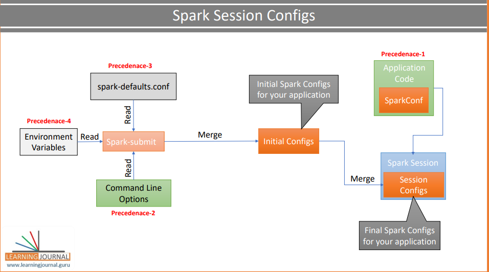

Based on the image precedence order will be `(high to low)` as shown below

1. Application configuration
2. spark-submit(CLI arguments)
3. spark-defaults.conf
4. Environment Variable

## DataFrame
Dataframe is the distributed data structure which is similar to table. This is the response type of the read() from SparkSession 
Object

> conf = SparkConfig.load_config() <br>
> spark = SparkSession.builder.config(conf=conf).getOrCreate()

**Note** <br>
> The above code will configure the spark session with the `conf` object. This object will read the configuration 
> from the spark.conf file Refer file [config_utils.py](HelloSpark/src/lib/config_utils.py) in HelloSpark project.

## Why Dataframe is a distributed Data structure?
spark session object will try to read the file from the storage location which may be centralized or distributed. In the
real project the storage will always be distributed and hence the file to be read will be broken into multiple chunks 
and stored in different storage system. spark session when reading the file using `spark.read.csv()` the method will 
return the file in chunks(partitions) and is stored in the same way in dataframe which will later be used by spark 
executors (JVM process). 


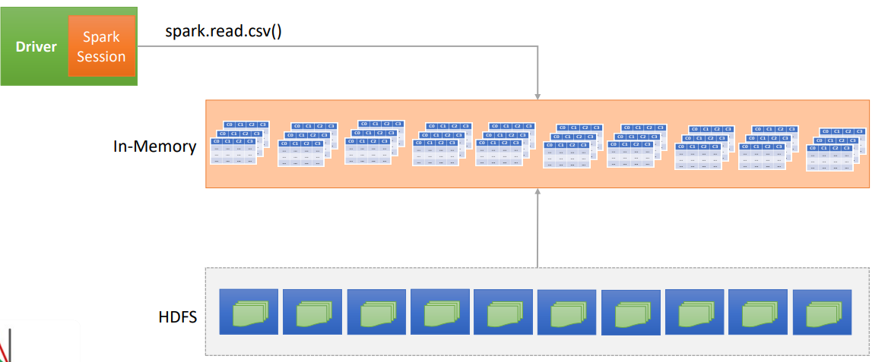

The above diagram shows how the data is partitioned in dataframe (in-memory distributed data structure)

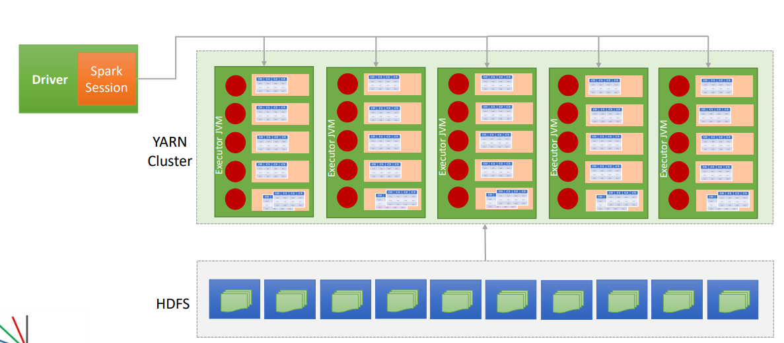

The above diagram shows how the data partitions from dataframe is submitted to spark executor once the spark-submit cli 
command is triggered 

**Note**
> Dataframe is immutable. 

## Spark Transformations
When Dataframe object loads the data to the memory then a series of operations performed on it like filter by conditions,
shortlisting columns and grouping them and so on. <br>Transformation is a lazy execution and this means transformation 
will be executed by the jvm executor until an action is triggered<br>

Let's see an example code below 
```python
spark.read.csv() \
     .select("Age", "Country", "Gender", "state) \
     .filter("Age>40")
     .groupBy("Country")
     .count()
```

In the above code spark session will create a new dataframe for each operation i.e. once the dataframe object is created
after the read.csv() operation, column shortlisting will happen after the select() operation which in turn will create a 
new dataframe object and filter() will be applied on top of that and finally groupBy() operation will be performed and a 
new dataframe object will be created. This is like a DAG chain as shown below 

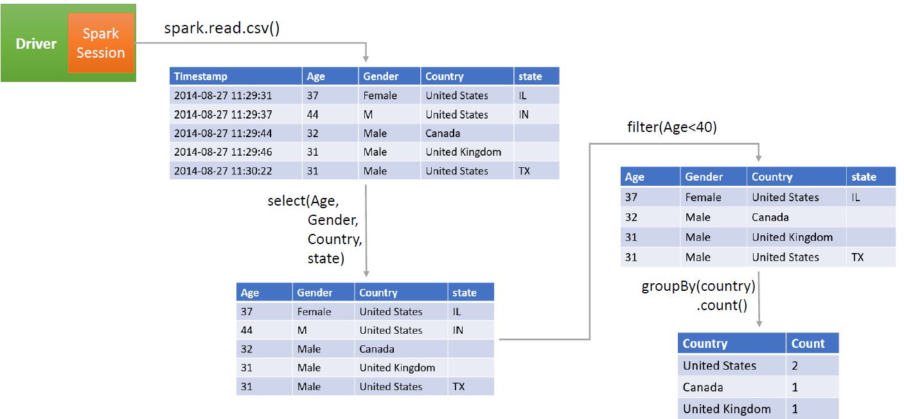

Methods that gets executed on one dataframe and creates a new dataframe out of it are called Transformations. For example,
after applying `filter("Age>40")` on the dataframe will create a new dataframe and hence `filter()` is a transformation.

One more thing to be observed in the above code snippet, select(), filter(), groupBy() & count() are all transformation 
that will not be executed until show() (an action method) is executed. 


## Transformation Types

Transformation are further classified into 2 and they are 
* Narrow dependency transformation 
* Wide dependency transformation

### Narrow Dependency Transformation

When the spark submit the job to the executors using spark-submit, executors will execute the operation and finally the 
results will be clubbed together which is valid. For example look at the following example 

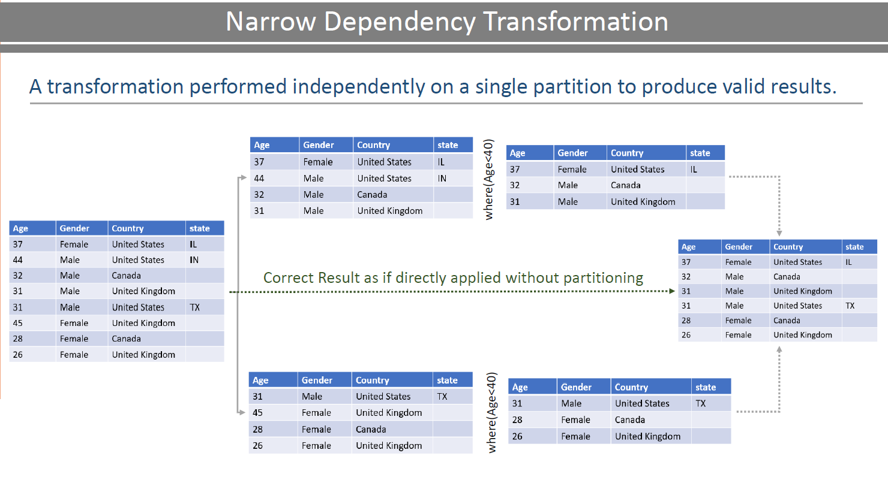

Some of the Narrow dependency transformation methods

* map
* filter

### Wide Dependency Transformation

When the spark submit the job to the executors using spark-submit, executors will execute the operation and shuffle the 
results between the partitions to a pattern so that the final merge of the results from all the patterns is valid. This
shuffling of partial results between the partitions is called sort& shuffle operation. For example look at the following
example 

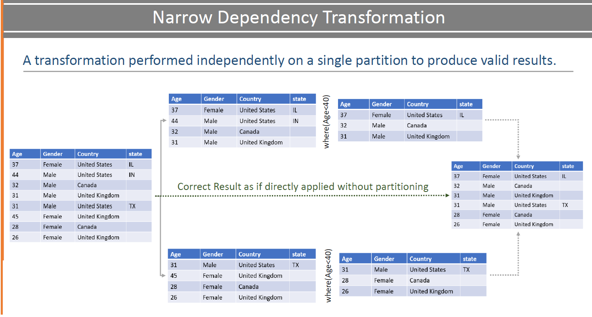

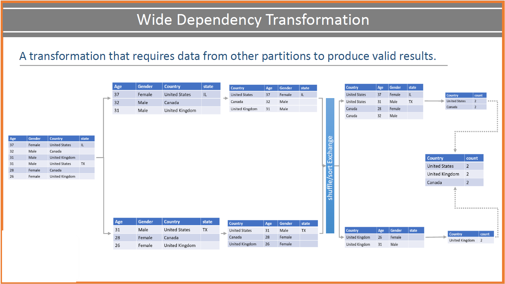

Some of the wide dependency transformation methods

* groupBy
* reduceBy
* join

## Spark Action
Apart from Transformation, there is another method classification called Action. Spark will work on applying multiple 
level transformations on the dataframe( where spark driver will create an execution plan to be executed by executors) 
and will return a value with actions like show(), count(), read() & write().

**Note**
    Spark driver will create the optimized executor plan based on the spark execution commands written in the program 
and executors will execute the executor plan.

Spark Driver will create the execution plan in the DAG format. An execution plan contains a set of jobs which in turn 
each job contains a set of stages and in turn each stage will have a set of tasks as shown below,

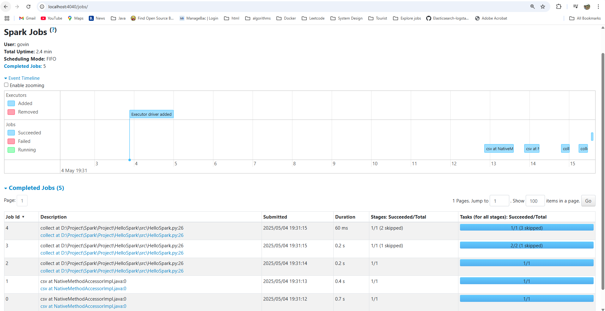

The job represents the list of steps to be executed in the DAG form as shown below
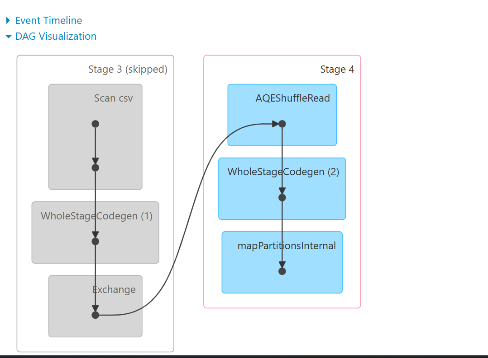

For every spark action a job will be executed by the scheduler.In the following code below,

```python
spark \
    .read \
    .option("header", "true")\
    .option("inferSchema", "true")\
    .csv(file_path)
```
read is an action and a job will be executed by the executor and .option("header") & .option("inferSchema") is an action
and hence a separate job will be executed by the job executor as shown below,

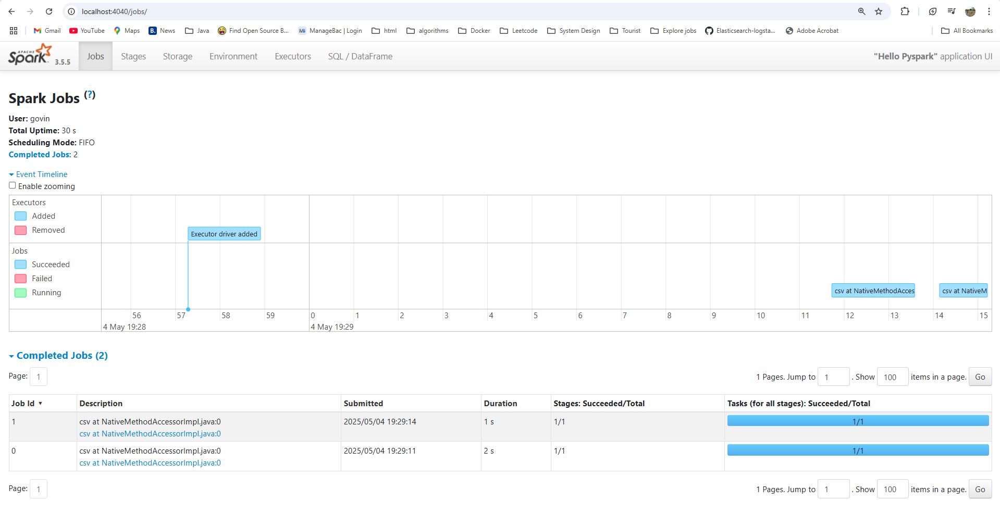

The following code snippet is a single action for which a job will be triggered,

```python
repartition_df = dataframe.repartition(2)
count_df = SparkConfig.get_country_count_above_age_40(repartition_df)
logger.info(count_df.collect())
```
collect() is an action. All transformations are clubbed together and spark driver will create an optimized execution 
plan and then collect() method will be triggered as a job in the executor.

**Note**
> what get_country_count_above_age_40() does refer [here](HelloSpark/src/lib/config_utils.py)


## What is RDD?
RDD is expanded as Resilient Distributed Dataset abd it is a data structure on which DataFrames are built. RDD is similar 
to python/java collections as it stores the records as a native language objects i.e. collection containing a python 
objects or java objects where each object is a record, unlike dataframe objects stored them as schemas.   

RDD is a Fault Tolerant system i.e. when the RDD job is submitted to the spark driver and the executors while executing 
some portion of data gets crashed then the driver will migrate the partition from crashed executor to another running 
executor so that the data is not lost.

RDD is not having a rich set of API like Dataframes, although dataframes are built on top of that RDD. 


## Why to use Spark Dataframe and Spark SQL over Spark RDD?
Spark SQL and Dataframes are usually optimized by the spark cost optimization engine (SPARK SQL Engine).  

What is Spark SQL Engine?

Spark SQL engine is a cost optimization engine which internally does 4 steps to complete the process
* Analysis <br>
    Analyze the SQL, dataframe code and raises analysis error if any unresolved names detected in the SQL and dataframe 
  filters.
* Logical Optimization<br>
    SQL engine will apply rule based optimization and construct a set of execution steps i.e. execution plan and the 
    catalyst optimizer will apply cost to each execution step. This step includes constant folding, predicate pushdown, 
    projection pruning, boolean expression simplification
* Physical Planning<br>
    This step will take the optimized logical plan generated from the previous step and generate a physical optimized 
    plan which will be executed by the JVM executor. The physical optimized plan is nothing but the set of RDD execution 
    steps
* Code Generation<br>
   This step will generate the efficient jvm byte code which will be executed by the spark engine in the JVM executors. 

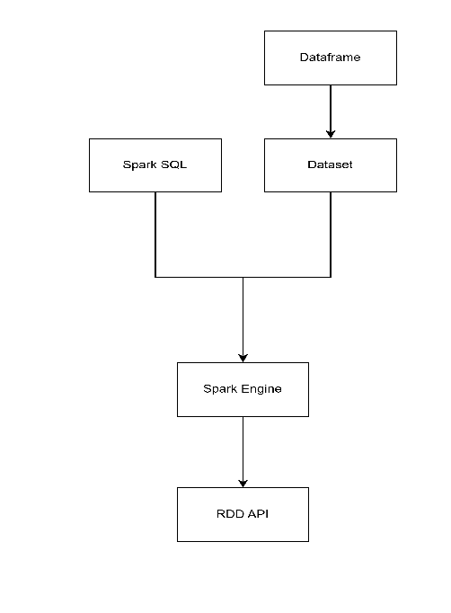

## References

* [Transformation vs action](https://medium.com/@roshmitadey/pyspark-transformations-v-s-actions-797fc8ad16ea)
* [spark configuration](https://spark.apache.org/docs/latest/configuration.html)