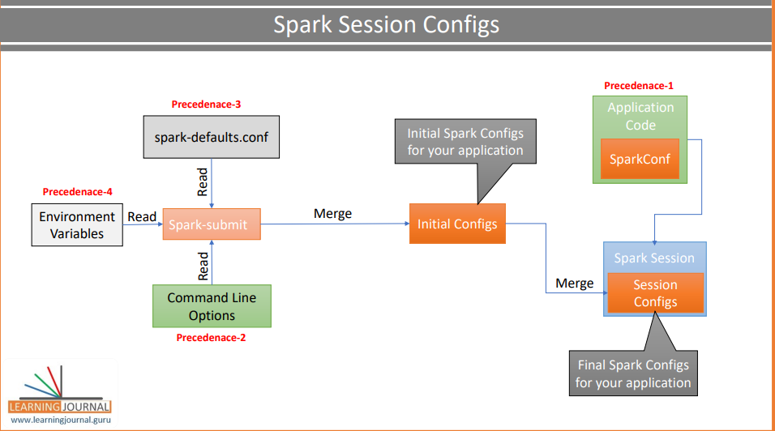

# Pyspark-Tutorial

## What is Spark?
  
  Spark is distributed data framework which involves 3 steps and they are

1. Read
2. Process
3. Write

## Ways of defining the configuration

While building the spark context object, configurations are loaded and can be done in the following ways 

   * Environment Variable
   * SPARK_HOME\conf\spark-defaults.conf
   * spark-submit command line arguments
   * Application Code

Environment Variable approach is to store the details of the spark like SPARK_HOME, HADOOP_HOME ...etc, this approach is
used only to create spark working environment mostly defined in spark running machines like cluster or local developers.

spark-defaults.conf is to store the common or default configurations that are commonly used by multiple spark 
applications running on the same cluster/local machine.

Command line arguments can be used to define configurations specific to application resources like number of exectutors, 
memory limits, CPU limits ...etc.
> Example   driver.memory   executor.instances

Example command for spark-submit
> spark-submit --master local[3] --conf "spark.app.name=Hello spark" --conf spark.eventlog.enabled=false Hellospark.py

Application code config can be used to define the runtime behaviour like number of retries
> Example   task.maxFailures   shuffle.partitions

When defining the application config in the code, config names should be known. Refer this 
<a href="https://spark.apache.org/docs/latest/configuration.html#application-properties"> link </a> 

**Note:**
> There is no clear boundaries between spark-submit command line arguments and application code. But a small thumb rule is
> when the argument starts with named flags like `--driver-memory`, `--driver-library-path` or `--executor-memory` use 
> them in spark-submit as command line arguments otherwise define them in application code.  

## Order of precedence of Config

Based on the image precedence order will be `(high to low)` as shown below

1. Application configuration
2. spark-submit(CLI arguments)
3. spark-defaults.conf
4. Environment Variable

## DataFrame
Dataframe is the data structure which is similar to table. This is the response type of the read() from SparkSession 
Object

> conf = SparkConfig.load_config()  
> spark = SparkSession.builder.config(conf=conf).getOrCreate()

**Note**  
> The above code will configure the spark session with the `conf` object. This object will read the configuration 
> from the spark.conf file Refer file [config_utils.py](HelloSpark/src/lib/config_utils.py) in HelloSpark project.
